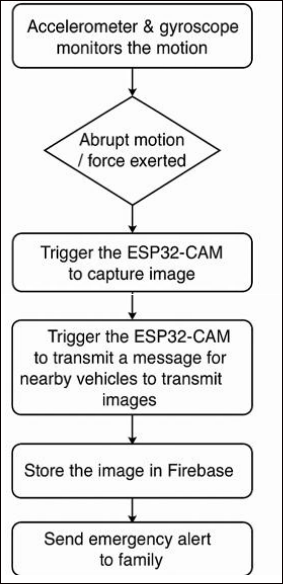
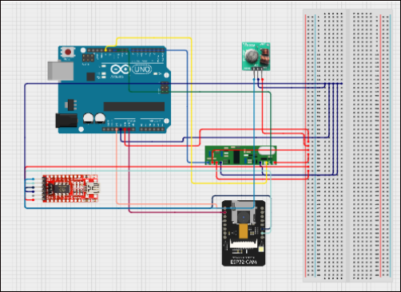

# Accident-Reporting-System-(IoT-Android-Firebase)

Proposes an IoT-based Accident Reporting System that uses sensors and wireless communication to automatically detect and report road accidents in real-time.

## Features

- Automatic accident detection
- Image capture for evidence
- Real-time alert transmission
- Low power consumption
- Firebase storage for remote access
- Easy integration with other IoT modules

## Components used :

## Hardware

- 1.ESP32-CAM
- 2.RF Transmitter & Receiver
- 3.Breadboard
- 4.Mobile Phone (with accelerometer & gyroscope)

## Software

- 1.Arduino IDE
- 2.Android Studio
- 3.Firebase SDK

  ## Workflow

  

  ## Circuit Diagram

  

  For more details check out this documentation [Documentation](documentation.pdf)
  

  ## Author
  ## Sailaja S
